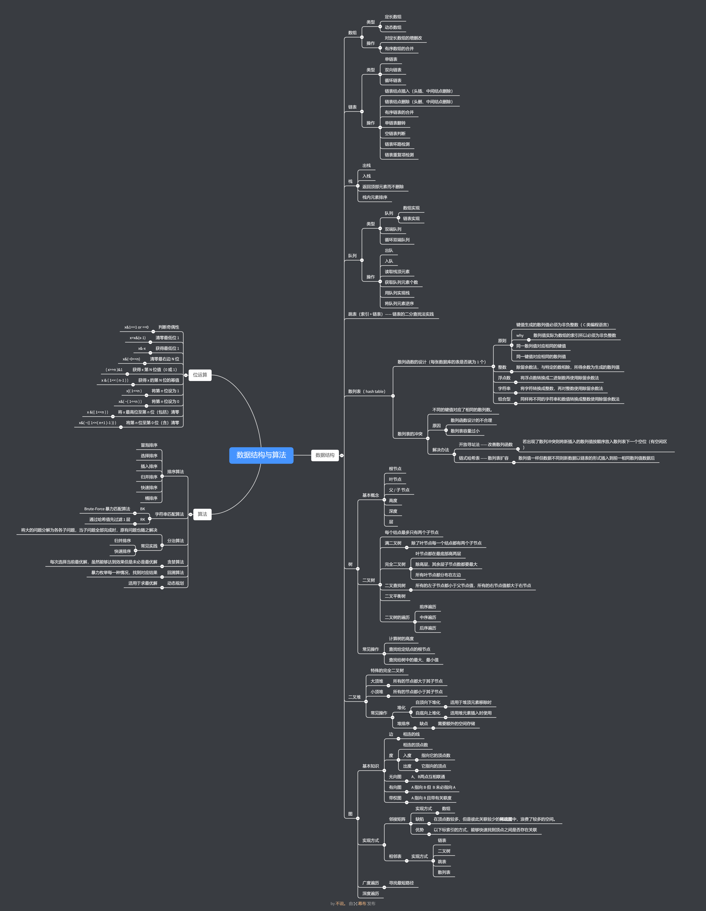

# LeetCode
我会在这里存放我的 LeetCode 刷题代码

同时记录我数据结构与算法的学习过程

如果感兴趣你也可以关注我的另一个项目《[剑指 offer 攻略](https://github.com/hackhu2019/offer)》：https://github.com/hackhu2019/offer

如果你想系统性的学习数据结构与算法相关的知识推荐你购买王争老师的专栏《[数据结构与算法之美](https://time.geekbang.org/column/intro/126)》:https://time.geekbang.org/column/intro/126